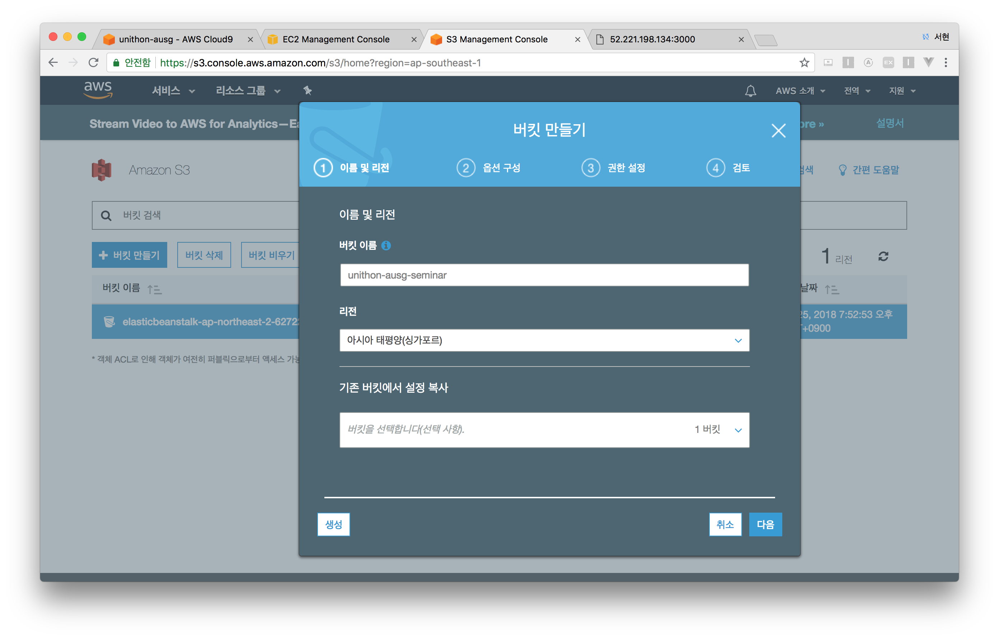
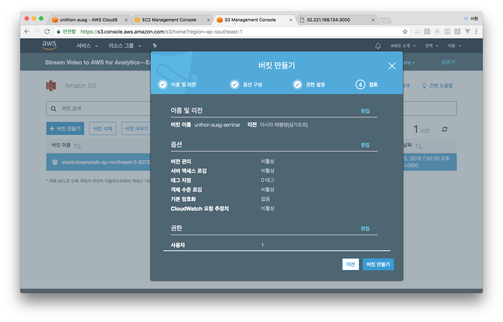
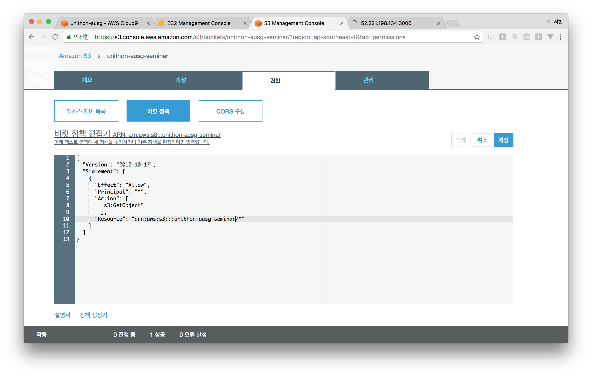
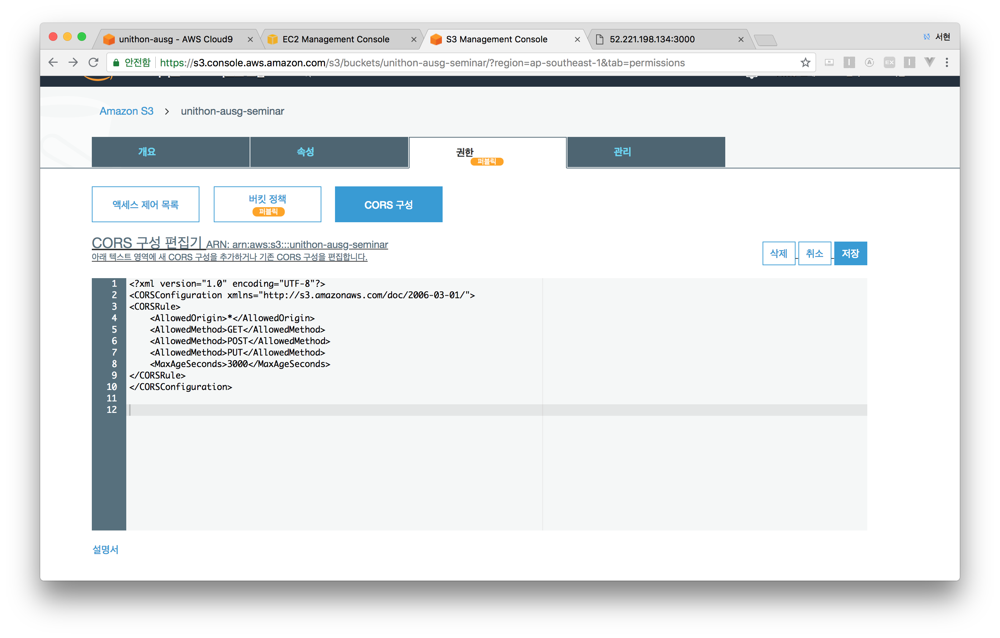

# AWS S3

## S3 생성하기

- S3 서비스로 이동해주세요.
- 버킷만들기를 클릭해주세요.



- 원하는 버킷 이름을 적어주세요.
- 싱가포르 리전을 선택해주세요.



- 모든 설정을 **그대로 둔 채** 다음을 눌러주세요.
- 버킷 만들기 클릭 > 해당 버킷 > 버킷 정책
- 아래의 값을 복사, 붙여넣기 하고, 버킷 생성시 입력한 이름을 **버킷이름입력**에 넣어주세요.

```
{
  "Version": "2012-10-17",
  "Statement": [
    {
      "Effect": "Allow",
      "Principal": "*",
      "Action": [
        "s3:GetObject"
        ],
      "Resource": "arn:aws:s3:::버킷이름입력/*"
    }
  ]
}
```




- CORS 구성을 클릭해주세요. 
- 마찬가지로 아래의 값을 복사, 붙여넣기 해주세요.

```
<?xml version="1.0" encoding="UTF-8"?>
<CORSConfiguration xmlns="http://s3.amazonaws.com/doc/2006-03-01/">
<CORSRule>
    <AllowedOrigin>*</AllowedOrigin>
    <AllowedMethod>GET</AllowedMethod>
    <AllowedMethod>POST</AllowedMethod>
    <AllowedMethod>PUT</AllowedMethod>
    <MaxAgeSeconds>3000</MaxAgeSeconds>
</CORSRule>
</CORSConfiguration>
```



축하드립니다! 다음 세션 [AWS RDS](/3_RDS/README.md) 으로 넘어가주세요.
