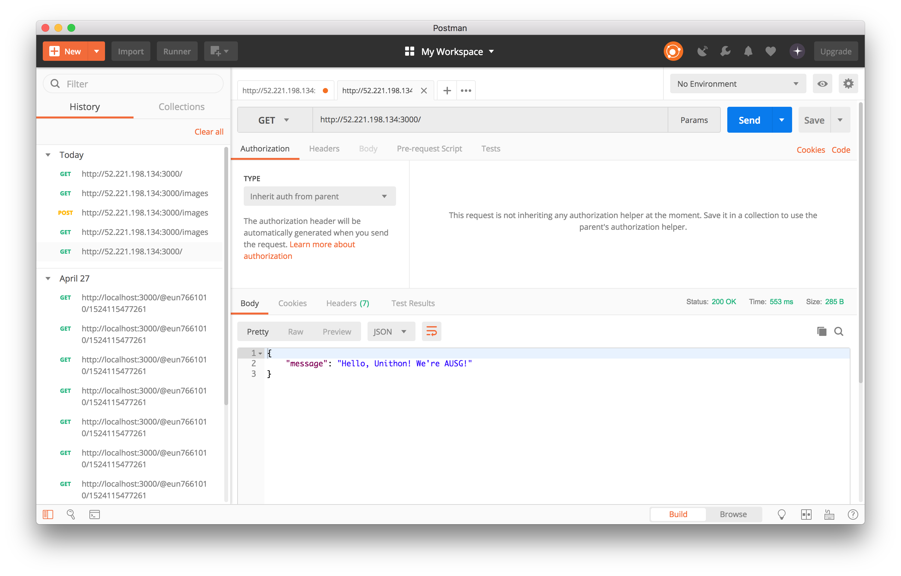
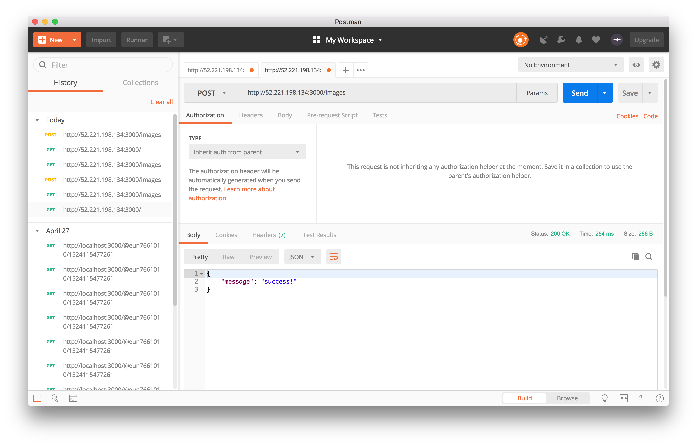
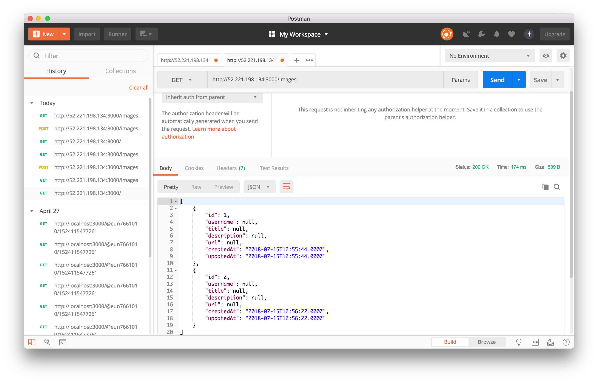

# Sequelize.js

## 설치

Sequelize를 설치해봅시다. Cloud9으로 이동해 다음 명령어를 터미널에 입력해주세요. 

```bash
$ npm install mysql2 sequelize --save
```

설치 완료!


## Sequelize 연동

index.js 를 다음과 같이 수정해주세요.

```javascript
const express = require('express')
const bodyParser = require('body-parser')
const cors = require('cors')
const app = express()

////----------- 추가 
const Sequelize = require('sequelize')
const sequelize = new Sequelize('DB이름', '마스터사용자이름', '마스터암호', {
    host: '확인한엔드포인트주소',
    dialect: 'mysql',
});
////----------- 추가

app.use(cors())
app.use(bodyParser.json())
app.get('/', function (req, res) {
    res.json({
        message: "Hello, Unithon! We're AUSG!",
    })
})

app.listen(3000)
```


## Model 연동

자바스크립트 객체와 실체 테이블을 매핑하기 위해서는 모델을 정의해야합니다. Sequelize는 다음과 같이 모델을 정의할 수 있는 메소드를 제공합니다. 다음과 같이 index.js 코드를 수정해주세요. 

```js
const express = require('express')
const bodyParser = require('body-parser')
const cors = require('cors')
const app = express()

const Sequelize = require('sequelize')
const sequelize = new Sequelize('DB이름', '마스터사용자이름', '마스터암호', {
    host: '확인한엔드포인트주소',
    dialect: 'mysql',
});

////----------- 추가
const ImagePost = sequelize.define('image_post', {
    id: {
        type: Sequelize.INTEGER,
        primaryKey: true,
        autoIncrement: true,
    },
    username: Sequelize.STRING,
    title: Sequelize.STRING,
    description: Sequelize.TEXT,
    url: Sequelize.STRING,
})
ImagePost.sync({ alter: true })
////----------- 추가

app.use(cors())
app.use(bodyParser.json())
app.get('/', function (req, res) {
    res.json({
        message: "Hello, Unithon! We're AUSG!",
    })
})

app.listen(3000)
```


## 엔드포인트 생성

몇가지 엔드포인트를 만들어봅시다. 

- **GET/images**

> 현재 DB에 업데이트된 모든 자료를 가져옵니다. 

- **POST/images**

> 현재 DB에 새 자료를 업로드합니다. 


코드를 수정해봅시다.

```js
const express = require('express')
const bodyParser = require('body-parser')
const cors = require('cors')
const app = express()

const Sequelize = require('sequelize')
const sequelize = new Sequelize('DB이름', '마스터사용자이름', '마스터암호', {
    host: '확인한엔드포인트주소',
    dialect: 'mysql',
});

const ImagePost = sequelize.define('image_post', {
    id: {
        type: Sequelize.INTEGER,
        primaryKey: true,
        autoIncrement: true,
    },
    username: Sequelize.STRING,
    title: Sequelize.STRING,
    description: Sequelize.TEXT,
    url: Sequelize.STRING,
})

ImagePost.sync({ alter: true })

app.use(cors())
app.use(bodyParser.json())

app.get('/', function (req, res) {
    res.json({
        message: "Hello, Unithon! We're AUSG!",
    })
})

////----------- 추가
app.get('/images', function (req, res) {
    ImagePost.findAll()
        .then(function (result) {
            res.json(result)
        })
        .catch(function (error) {
            res.json(error)
        })
})

app.post('/images', function (req, res) {
    ImagePost.create({
        title: req.body.title,
        description: req.body.description,
        url: req.body.url,
    }).then(function () {
        res.json({
            message: 'success!',
        })
    }).catch(function (error) {
        res.json({
            message: 'failed!',
        })
        console.log(error)
    })
})
////----------- 추가

app.listen(3000)
```


## S3 업로드용 Pre-signed URL을 만드는 엔드포인트 추가

AWS-SDK를 설치해봅시다. 터미널에 다음 명령어를 입력해주세요.

```bash
$ npm install aws-sdk --save
```


엔드포인트를 추가해주세요.

```js
const express = require('express')
const bodyParser = require('body-parser')
const cors = require('cors')
const app = express()

const Sequelize = require('sequelize')
const sequelize = new Sequelize('DB이름', '마스터사용자이름', '마스터암호', {
  host: '확인한엔드포인트주소',
  dialect: 'mysql',
});

const ImagePost = sequelize.define('image_post', {
  id: {
      type: Sequelize.INTEGER,
      primaryKey: true,
      autoIncrement: true,
  },
  username: Sequelize.STRING,
  title: Sequelize.STRING,
  description: Sequelize.TEXT,
  url: Sequelize.STRING,
})

ImagePost.sync({ alter: true })

app.use(cors())
app.use(bodyParser.json())

app.get('/', function (req, res) {
  res.json({
      message: "Hello, Unithon! We're AUSG!",
  })
})

app.get('/images', function (req, res) {
  ImagePost.findAll()
      .then(function (result) {
          res.json(result)
      })
      .catch(function (error) {
          res.json(error)
      })
})

app.post('/images', function (req, res) {
  ImagePost.create({
      title: req.body.title,
      description: req.body.description,
      url: req.body.url,
  }).then(function () {
      res.json({
          message: 'success!',
      })
  }).catch(function (error) {
      res.json({
          message: 'failed!',
      })
      console.log(error)
  })
})  

////----------- 추가
const AWS = require('aws-sdk')
const s3 = new AWS.S3({
  region: 'ap-southeast-1',
  signatureVersion: 'v4',
})

app.post('/generatePresignedUrl', function (req, res) {
  const key = `${Date.now()}_${req.body.filename}`
  const params = {
      Bucket: '버킷 이름',
      Key: key,
      ACL: 'public-read',
  }
  const presignedUrl = s3.getSignedUrl('putObject', params)
  res.json({
      url: `https://s3-ap-southeast-1.amazonaws.com/${params.Bucket}/${key}`,
      presignedUrl,
  })
})
////----------- 추가

app.listen(3000)
```

코드가 완성되었습니다. Postman을 활용해 각 엔드포인트별 결과를 확인해봅시다.


## Postman을 통해 확인해보기

만들었던 엔드포인트별 결과를 확인해봅시다. 

- 터미널에서 해당 앱을 실행해봅시다.

```bash
$ node index.js
```

- Cloud9의 우측 상단, **Share 버튼**을 클릭한 후 IP주소를 확인해주세요. 


**Postman**을 실행시켜봅시다. 

> GET, IP주소:3000을 입력하고 Send버튼을 눌러줍시다.



다음과 같이 출력된다면 성공!


> POST, IP주소:3000/images를 입력하고 Send버튼을 눌러봅시다.



"success!"가 출력된다면 성공!


> GET, IP주소:3000/images를 입력하고 Send버튼을 눌러봅시다.



다음과 같이 현재 DB에 업데이트된 모든 자료를 출력해준다면 성공!


축하합니다! 다음 세션으로 이동해주세요.